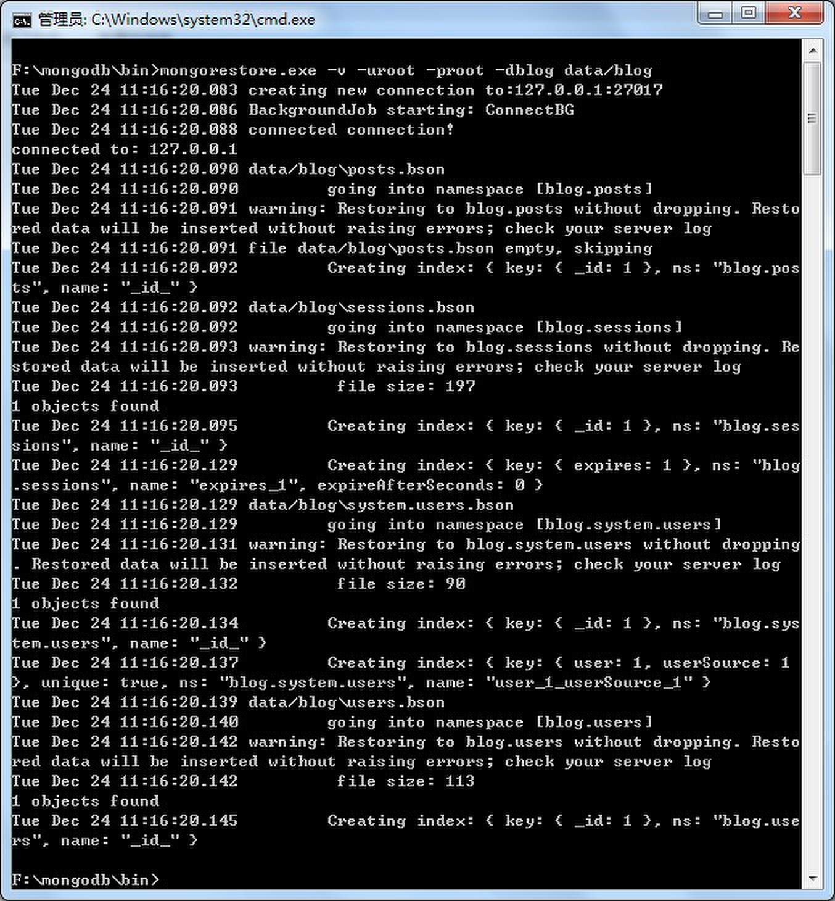

# 使用nodejs和mongodb创建的blog示例

项目构建状态：

项目依赖状态：

#数据库导入

* 将data目录拷贝到mongodb的安装目录下的bin目录中，然后参照下面的截图执行命令导入数据

注:由于blog数据库采用了认证创建了用户名密码(均为root),所以第一次导入的时候需要创建一个数据库名为blog切用户名密码为root方可顺利导入。

# 截图

* 主页

* 内容

